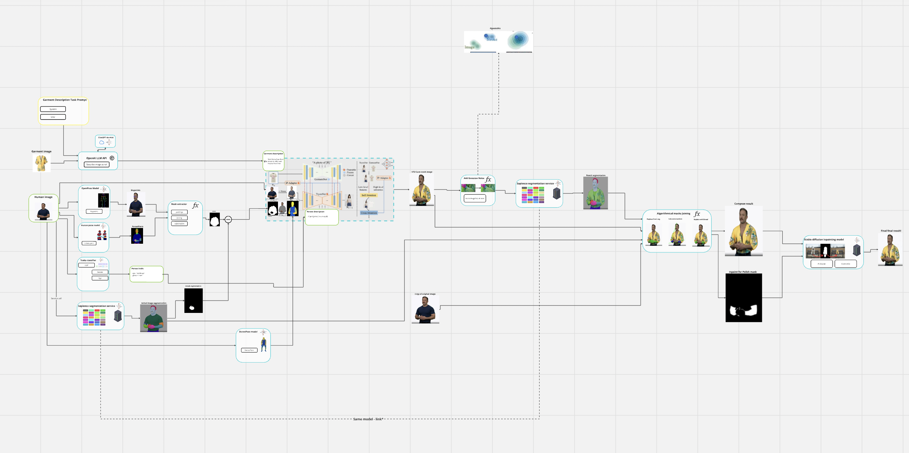
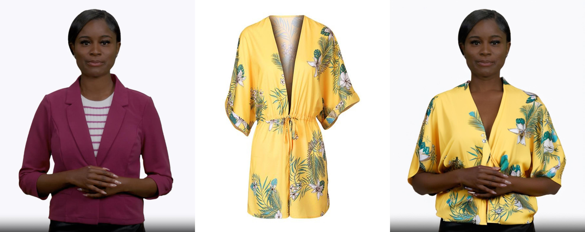
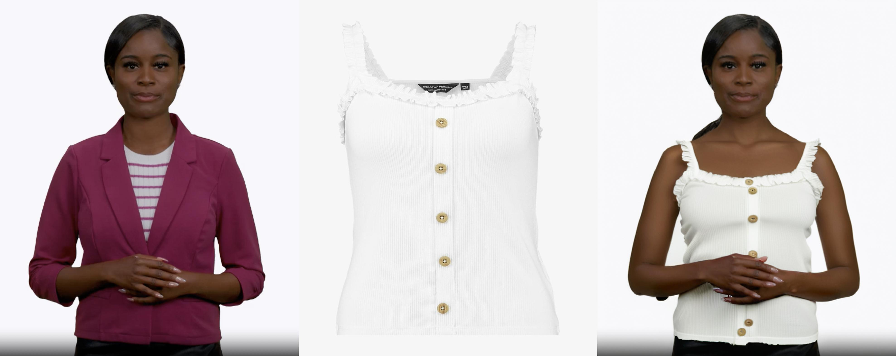
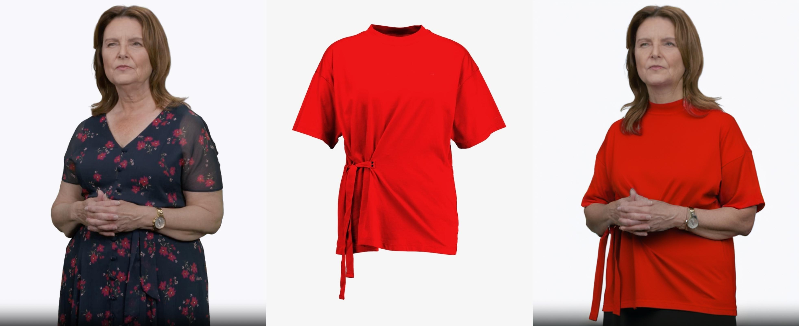
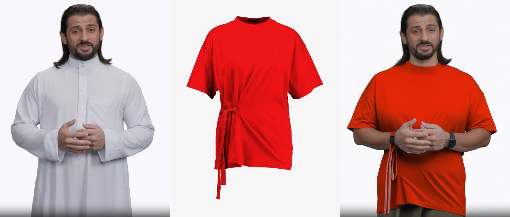
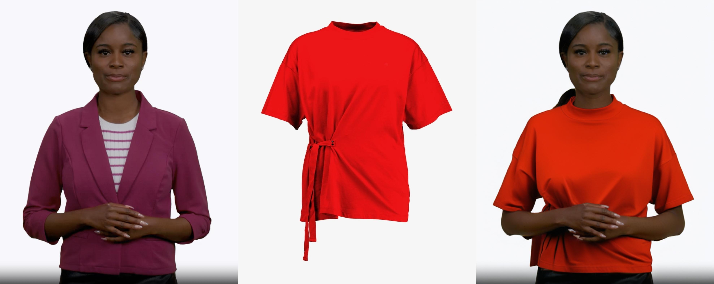
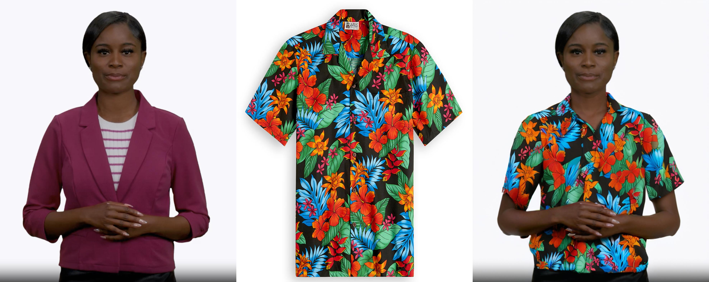

<h1>Improving IDM-VTON with some non-training tricks to fix drawbacks of the basic model</h1>

---
## Video Introduction
Please click on image to open the video on Google Drive:
&nbsp;

## High-Level Schema
Please click on image to open the board in Miro:
&nbsp;

## DISCLAMER!!!
All the results are just a demonstration of technology on avatars and do not carry a message to offend anyone

## Grid galery results
&nbsp;

## Zoom galery results
&nbsp;
&nbsp;
&nbsp;
&nbsp;
&nbsp;
&nbsp;
&nbsp;
&nbsp;
&nbsp;
&nbsp;
&nbsp;
&nbsp;
&nbsp;
&nbsp;
&nbsp;
&nbsp;
&nbsp;
&nbsp;
&nbsp;
&nbsp;
&nbsp;
&nbsp;

## Acknowledgements
Thanks [IDM_VTON](https://github.com/yisol/IDM-VTON) for the baseline.
Thanks [Sapience-seg](https://huggingface.co/spaces/facebook/sapiens-seg) for the segmentation masks.

## License
The codes and checkpoints in this repository are under the [CC BY-NC-SA 4.0 license](https://creativecommons.org/licenses/by-nc-sa/4.0/legalcode).
